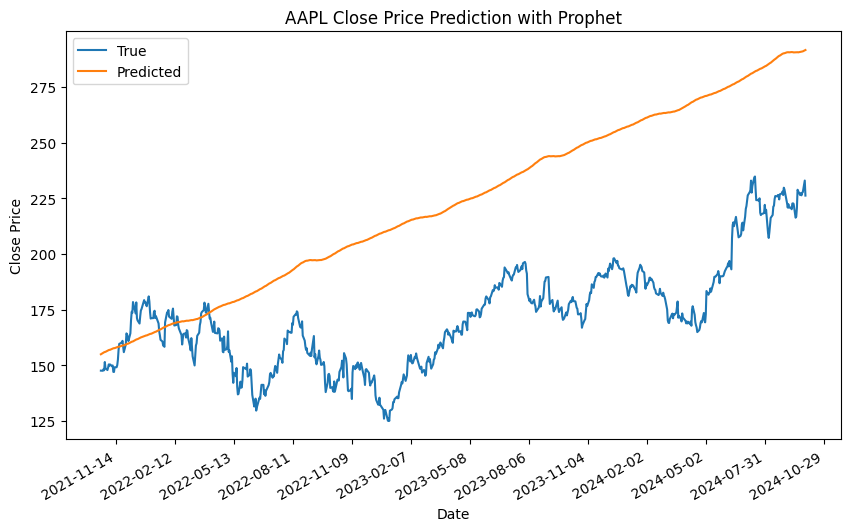
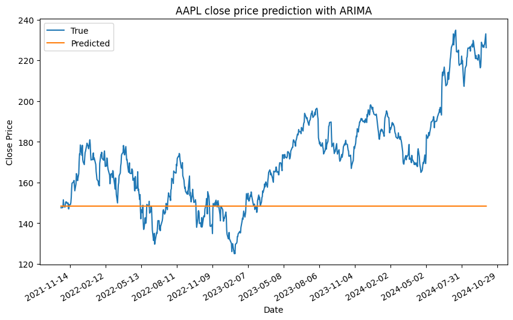
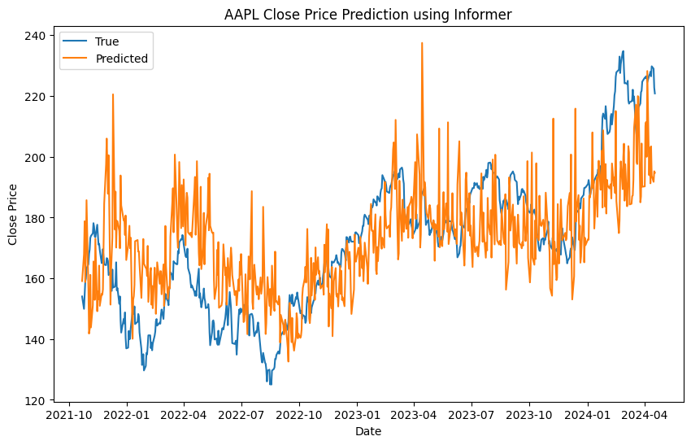
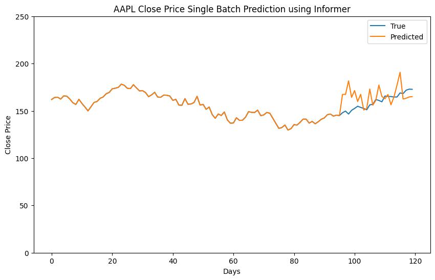

# Stock Prediction Using Informer Network

## Project Overview

This repository contains the implementation of a stock price prediction model using the Informer architecture. I compare the Informer model to traditional time series forecasting methods, including Prophet and ARIMA, to demonstrate the advantages of modern deep learning approaches in complex time series forecasting tasks like stock price prediction.

## Problem Statement

Stock price forecasting is a challenging time series prediction problem due to its highly volatile and non-linear nature. The ability to accurately predict stock prices can provide a competitive advantage for traders and financial institutions.

## Common Time Series Forecasting Approaches

- __ARIMA__ (AutoRegressive Integrated Moving Average): A statistical method that models the linear relationship in time series data. It assumes that future values can be predicted using previous observations.

- __Prophet__: A robust forecasting tool developed by Meta, which can handle time series with missing data, seasonal patterns, and outliers. It is useful for business time series predictions but may struggle with highly volatile financial data.

## Informer Network

Informer is a deep learning architecture designed for time series forecasting, particularly long sequences. It uses a self-attention mechanism and a _ProbSparse_ attention to efficiently model long-term dependencies, making it highly suitable for forecasting stock prices.

## Data Collection and Analysis
AAPL daily historical price data was collected from open source. Collected data was further expanded by calculating different technical indicators such as SMA, EMA, bollinger bands, RSI, ROC and others. Multiple combinations of these indicators were considered in order to train the model.

## Challenges
AAPL stock price has a high volatility and sharp upward trend since the end of 2020. This leads to and obvious difficulty of forecasting using complex deep learning model, since the test data should be newer than training data, so the range of test data values due to the sharp upward trend could be way out of range of those on which model was trained. This leads to a much worse precision of forecasting.

## Training
3 models were trained with only changes in dropout value and number of epochs. The best model was trained with number of epochs being 30 and dropout being 0.1. It allowed model not to overfit the training data and to be able to predict out of range values. Model takes the last 96 date inputs and predict stock price for following 24 days.

## Model Comparison

I compared the trained model to ARIMA and Prophet models on the same data using following metrics: 
- MAE (Mean Absoluter Error)
- MSE (Mean Squared Error)
- MAPE (Mean Absolute Percentage Error)

|Model|MAE|MAPE|MSE|
|-----|---|----|---|
|Informer|16.0|0.09|397.2|
|ARIMA|26.3|0.14|1126.0|
|Prophet|51.9|0.30|3362.9|

As it can be seen Informer outperformed ARIMA and Prophet in all 3 metrics. However, it should be mentioned that metrics computation were done on test data and since ARIMA, Prophet can generate predictions for whole test set, while Informer can only generate 24 at once, the mean over all Informer predictions were calculated, which may lead to a bias results. 

## Graphs

